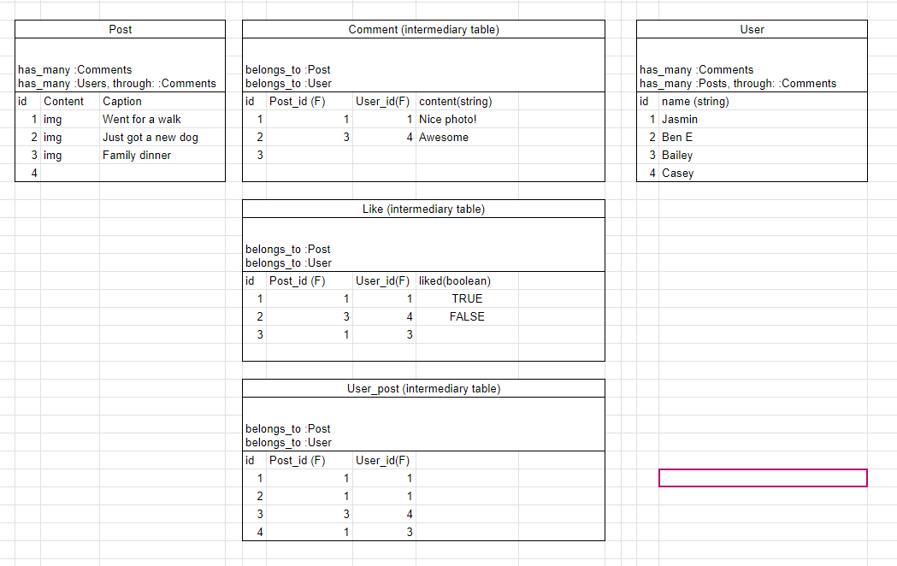
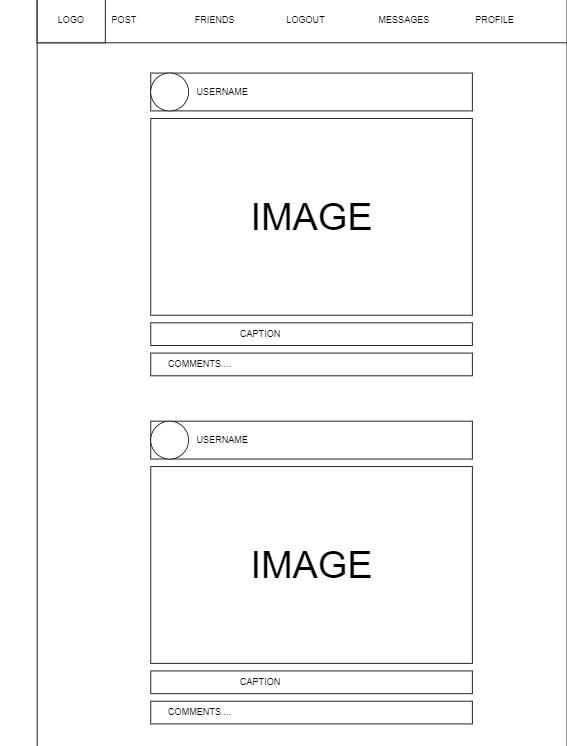

# YAPPIN 💬
> By Eman Gurang
#
## Yappin is a social platform where users are able to interact and connect with one another!.

# GITHUB REPO
- https://github.com/winterwithouther/YappinProject

# Functionality MVP
- CREATE : post, user, comment, like
- READ : post, user, comment, like
- PATCH : post, user, comment
- DELETE : post, comment, like

# API routes
- /posts GET, POST
- /posts/id GET, PATCH, DELETE
- /users GET, POST
- /users/id GET, PATCH
- /comments GET, POST
- /comments/id GET, PATCH, DELETE
- /likes GET, POST
- /likes/id GET, DELETE

# Validations
- Validate that user is 13 and older
- Validate that username is greater than 4 characters
- Validate that password is greater than 10 characters
- Validate that post content not None
- Validate that comment is greater than 0 characters
- Validate that post exists when querying
- Validate that user exists when querying
- Validate that comment exists when querying
- Validate that like exists when querying

# Stretch Goals
- Messaging
- User posts
- Group chats
- Replying to Comments
- Posting videos

# Wireframe and Relationship Diagram

